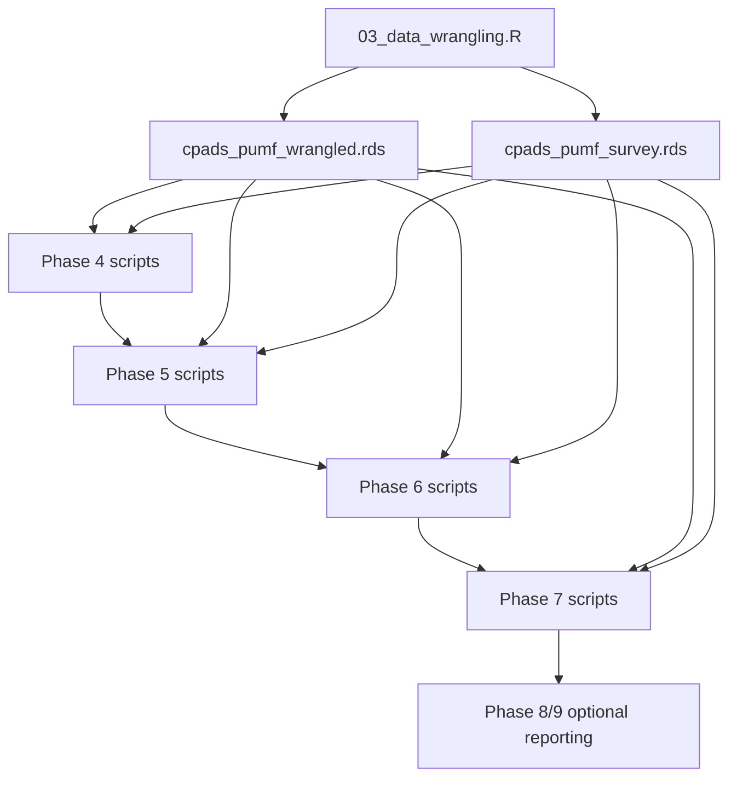

# Preliminaries

## Alcohol Use Among Canadian Postsecondary Students
### Exact Background-and-Initial Results Audit of the Current CPADS Workflow

**Document type:** Full-length IMRaD manuscript (audit-grade methods trace)  
**Date generated:** February 21, 2026  
**Author:** `Vansh Singh Ruhela`
**Project root:** `PROJECT_ROOT`  
**Primary raw input:** `PROJECT_ROOT/data/private/CPADS_PUMF.csv`  
**Primary wrangled inputs:** `PROJECT_ROOT/data/private/outputs/wrangled/cpads_pumf_wrangled.rds`, `PROJECT_ROOT/data/private/outputs/wrangled/cpads_pumf_survey.rds`  
**Output fidelity policy:** This manuscript describes the **current code/output behavior as generated**, and flags inconsistencies explicitly instead of silently correcting them.

---

# Abstract

## Background
This paper documents, with explicit procedural detail, how the current R analysis workflow in `PROJECT_ROOT` produced the listed CPADS output files, and how those outputs should be interpreted under a conservative causal framework.

## Objective
To provide a decision-complete, reproducible explanation of (1) exact code operations, (2) statistical procedures, and (3) result interpretation for all listed output CSV files.

## Data and design
The workflow uses CPADS 2021-2022 PUMF microdata (`n = 40,931` rows; 394 raw columns). Data are wrangled in Phase 3 and then analyzed in Phases 4-7, with optional presentation/report phases in Phases 8-9.

## Background overview
The workflow includes: data wrangling and derived-variable construction, survey-weighted descriptive probability estimates, distribution diagnostics, frequentist hypothesis testing with multiplicity control, Bayesian Beta-Binomial prevalence modeling and Bayes factors, power/MDE analyses (SRS and DEFF-adjusted), survey-weighted logistic and nested model comparisons, OLS and survey-GLM regression diagnostics, and causal estimation (naive, g-computation, IPW, AIPW manual fallback, matching-based ATT/ATE, CATE, and Rosenbaum-style sensitivity approximation).

## Key findings from current outputs
- Survey-weighted heavy drinking prevalence (past 30 days): `0.4580988313946399` (95% CI `0.45157944050517124` to `0.4646182222841086`) from `frequentist_heavy_drinking_prevalence_ci.csv`.
- Cannabis effect in primary survey-weighted logistic model: OR `5.7103` (95% CI `5.3761` to `6.0653`) from `logistic_odds_ratios.csv`.
- Causal ATE estimates cluster near `0.39-0.40` across estimators (`causal_estimator_comparison.csv`, `ipw_results.csv`, `treatment_effects_summary.csv`).

## Critical caveat
`probability_estimates.csv` reports `P(Alcohol12m | Cannabis12m) = 1.125098814119472` (>1), which is not a valid probability and is documented here as a known methodological inconsistency in the current implementation.

---

# Introduction

This manuscript is an explicit audit of the current CPADS analysis code and outputs. The goal is not to propose a new analysis, but to explain exactly what was done in the present workflow and to interpret outputs transparently.

The analysis problem focuses on alcohol and related substance-use outcomes in Canadian postsecondary students, with heavy drinking in the past 30 days as a central endpoint. The workflow integrates both descriptive and inferential methods and combines survey-weighted analyses with several unweighted and model-based components.

Because this project contains multiple scripts with different statistical paradigms, this paper emphasizes:
1. exact script-level operations;
2. input/output provenance for each generated file;
3. conservative interpretation of causal estimates conditional on assumptions;
4. explicit identification of internal inconsistencies and design tradeoffs.

---

# Data and Study Design

## Data source and file system layout

### Raw microdata
- `PROJECT_ROOT/data/private/CPADS_PUMF.csv`

### Cleaned artifacts used by downstream phases
- `PROJECT_ROOT/data/private/outputs/wrangled/cpads_pumf_wrangled.rds`
- `PROJECT_ROOT/data/private/outputs/wrangled/cpads_pumf_survey.rds`

### Core output directory
- `PROJECT_ROOT/data/private/outputs`

### Report directory
- `PROJECT_ROOT/reports/public`

## Raw and wrangled dimensions
- Raw input rows: `40,931`
- Raw input columns: `394`
- Cleaned rows: `40,931`
- Cleaned columns: `404`

No row-level filtering is done during Phase 3 wrangling; row loss occurs in later complete-case analyses depending on model variable sets.

## Phase 3 wrangling process (`PROJECT_ROOT/03_data_wrangling.R`)

### Step 1: Column normalization
- `janitor::clean_names()` is applied to all raw columns.
- Logged in `cpads_pumf_wrangling_log.csv` as `step = 1`.

### Step 2: Special missing-value recoding
- For all columns except `seqid` and `wtpumf`, values in `{97, 98, 99, 997, 998, 999}` are recoded to `NA`.
- Logged as `step = 2`, affecting `385 columns`.

### Step 3: Derived variables (exact recoding rules)
Derived variables created:
- `gender` from `dvdemq01`:
  - `1 -> Woman`
  - `2 -> Man`
  - `3 -> Transgender/Non-binary`
- `age_group` from `age_groups`:
  - `1 -> 16-19`
  - `2 -> 20-22`
  - `3 -> 23-25`
  - `4 -> 26+`
- `province_region` from `region`:
  - `1 -> Atlantic`
  - `2 -> Quebec`
  - `3 -> Ontario`
  - `4 -> Western`
- `alcohol_ever` from `alc03`:
  - `1 -> 1`
  - `2 -> 0`
- `alcohol_past12m` from `alc05`:
  - `1 -> 1`
  - `2 -> 0`
- `alcohol_frequency_30d` from `alc06` (ordered factor):
  - `1 daily_or_almost`, `2 2_to_5_times_week`, `3 once_week`, `4 2_to_3_times_past30`, `5 once_past30`, `6 not_past30`
- `heavy_drinking_30d` fallback logic:
  - if `alc12_30d_prev_total` is `1` or `0`, use it;
  - else if `alc12_30d_prev` is `1` or `0`, use it;
  - else `NA`.
- `cannabis_any_use` from `can05`:
  - `1 -> 1`
  - `2 -> 0`
- `physical_health` from `hwbq01`:
  - `1 Excellent`, `2 Very Good`, `3 Good`, `4 Fair`, `5 Poor`
- `mental_health` from `hwbq02`:
  - `1 Excellent`, `2 Very Good`, `3 Good`, `4 Fair`, `5 Poor`

### Step 4: Derived variable distribution printing
The script prints frequency distributions for each derived variable to console (no separate CSV output for this step).

### Step 5: Missingness summary
A complete variable-wise NA percentage table is generated as `cpads_pumf_na_summary.csv`.

Key NA percentages for major analysis variables from current output:
- `heavy_drinking_30d`: `22.5%`
- `alcohol_past12m`: `13.6%`
- `cannabis_any_use`: `1.1%`
- `mental_health`: `1.0%`
- `gender`: `0.7%`
- `physical_health`: `0.5%`
- `alcohol_ever`: `0.3%`

### Step 6: Survey design object construction
- Survey object is built with `survey::svydesign(ids = ~1, weights = ~wtpumf, data = pumf_clean)`.
- Persisted to `cpads_pumf_survey.rds`.

### Phase 3 saved outputs
- `PROJECT_ROOT/data/private/outputs/wrangled/cpads_pumf_wrangled.rds`
- `PROJECT_ROOT/data/private/outputs/wrangled/cpads_pumf_survey.rds`
- `PROJECT_ROOT/data/private/outputs/cpads_pumf_wrangling_log.csv`
- `PROJECT_ROOT/data/private/outputs/cpads_pumf_na_summary.csv`

---

# End-to-End Workflow Architecture

## Core execution architecture
The workflow is phase-based. Downstream scripts read the wrangled `.rds` artifacts and emit phase-specific CSV outputs under `PROJECT_ROOT/data/private/outputs`.

## Script-to-output provenance (all listed CSV outputs)

| Output CSV | Generating script(s) | Method family |
|---|---|---|
| `cpads_pumf_wrangling_log.csv` | `03_data_wrangling.R` | Data engineering audit log |
| `cpads_pumf_na_summary.csv` | `03_data_wrangling.R` | Missingness quantification |
| `probability_estimates.csv` | `04_descriptive_stats.R` | Survey-weighted probability estimation |
| `clt_convergence.csv` | `04_descriptive_stats.R` | CLT simulation diagnostics |
| `distribution_tests.csv` | `04_distributions.R` | Shapiro/KS/log-normal tests |
| `binomial_summaries.csv` | `04_distributions.R` | Unweighted binomial summaries |
| `binomial_summaries_survey_weighted.csv` | `04_distributions.R` | Survey-weighted prevalence summaries |
| `frequentist_heavy_drinking_prevalence_ci.csv` | `05_frequentist.R` | Survey-weighted prevalence + CI |
| `frequentist_hypothesis_tests.csv` | `05_frequentist.R` | Wald + pairwise `svyttest` + multiplicity control |
| `frequentist_effect_sizes.csv` | `05_frequentist.R` | Cohen's h pairwise effect sizes |
| `bayesian_posterior_summaries.csv` | `05_bayesian.R` | Beta-Binomial posterior summaries |
| `bayesian_bayes_factors.csv` | `05_bayesian.R` | Contingency-table Bayes factors |
| `bayesian_vs_frequentist_ci.csv` | `05_bayesian.R` | CI/CrI comparative table |
| `power_one_proportion_grid.csv` | `05_power_design.R` | One-proportion power grid |
| `power_two_proportion_gender.csv` | `05_power_design.R` | Two-proportion gender power |
| `power_analysis_summary.csv` | `05_power_design.R` | DEFF, n_eff, and MDE summary |
| `logistic_odds_ratios.csv` | `06_logistic.R` | Survey-weighted quasibinomial logistic model |
| `logistic_smote_odds_ratios.csv` | `06_logistic.R` | SMOTE/oversampling sensitivity logistic model |
| `model_comparison_summary.csv` | `06_model_comparison.R` | Nested survey-model deviance/AIC summary |
| `model_comparison_wald_tests.csv` | `06_model_comparison.R` | Predictor-specific Wald tests in full model |
| `model_comparison_full_coefs.csv` | `06_model_comparison.R` | Full-model OR/CI coefficient table |
| `regression_coefficients.csv` | `06_regression.R` | OLS + survey-GLM coefficient export |
| `alcohol_correlation_matrix.csv` | `06_regression.R` | Pearson correlation matrix export |
| `regression_model_comparison.csv` | `06_regression.R` | Null vs adjusted survey-GLM comparison |
| `ipw_results.csv` | `07_propensity.R` | IPW ATE with bootstrap CI |
| `causal_estimator_comparison.csv` | `07_causal_estimators.R` | Naive/G-comp/IPW/AIPW ATE comparison |
| `treatment_effects_summary.csv` | `07_treatment_effects.R` | ATE/ATT/ATC (IPW + matching variants) |
| `cate_subgroup_estimates.csv` | `07_treatment_effects.R` | Unadjusted subgroup CATE contrasts |

Optional scripts (`07_meta_synthesis.R`, `08_figures.R`, `08_tables.R`, `09_report.R`, `07_dag.R`) generate figures/reports/auxiliary outputs and are not required to produce the listed core CSV set.

---

# Background (Phase-by-Phase)

## Phase 4 descriptive probability (`04_descriptive_stats.R`)

### Estimands
- Weighted marginal prevalences:
  - `P(alcohol_ever)`
  - `P(alcohol_past12m)`
  - `P(heavy_drinking_30d)`
  - `P(cannabis_any_use)`
- Weighted joint probability `P(alcohol_past12m ∩ cannabis_any_use)`.
- Derived conditional probabilities via ratio identities and direct weighted subgroup means.
- Bayes-rule illustrative quantity for poor/fair mental health and heavy drinking.

### Statistical operations
- Survey-weighted means via `survey::svymean` and CIs via `confint`.
- Group-specific weighted prevalences via `survey::svyby`.
- Independence checks:
  - Unweighted Pearson `chisq.test`.
  - Survey-weighted `survey::svychisq`.
- CLT demonstration via bootstrap-like repeated sampling (`n_samples = 1000`) at sample sizes `10, 30, 100, 500`.

### Key formula forms used
- Conditional probability by ratio:
  \[
  P(A\mid B) = \frac{P(A \cap B)}{P(B)}
  \]
- Bayes rule demonstration:
  \[
  P(B\mid A) = \frac{P(A\mid B)P(B)}{P(A)}
  \]

## Phase 4 distribution diagnostics (`04_distributions.R`)

### Variables tested
- `wtpumf`
- `alc03` constrained to `[1,7]`
- `alc06` constrained to `[1,6]`

### Tests and implementation details
- Shapiro-Wilk normality test (`n <= 5000` sample if larger).
- KS test against normal with estimated parameters (explicitly noted as approximate).
- Log-normal diagnostic via Shapiro on `log(X)` for positive-valued variables.

### Binomial summaries
- Unweighted summary for binary variables with Wald CI.
- Survey-weighted prevalence summary with `svymean` + `SE` + `confint`.

## Phase 5a frequentist inference (`05_frequentist.R`)

### Outcome
- `heavy_drinking_30d` (numeric binary 0/1 enforced).

### Prevalence estimation
- Overall and subgroup weighted prevalence/CI for:
  - `gender`
  - `age_group`
  - `province_region`
  - `mental_health`

### Hypothesis testing
- Overall omnibus differences by grouping variable using survey-weighted logistic model:
  - `svyglm(..., family = quasibinomial())`
  - `regTermTest(..., method = "Wald")`
- Pairwise comparisons with `survey::svyttest` on pair-specific subdesigns.

### Multiplicity control
- Bonferroni and BH-FDR applied across all collected p-values.

### Effect sizes
- Cohen's h for pairwise prevalence differences:
  \[
  h = 2\arcsin\sqrt{p_1} - 2\arcsin\sqrt{p_2}
  \]
- Unweighted Cohen's w for contingency association:
  \[
  w = \sqrt{\chi^2/N}
  \]

## Phase 5b Bayesian inference (`05_bayesian.R`)

### Primary target
- Binary heavy drinking prevalence (`heavy_drinking_30d`) using **unweighted** counts for conjugate updating.

### Prior families
- Uninformative: Beta(1,1)
- Weakly informative: Beta(2,2)
- Informative: Beta(10,30)

### Posterior update
Given successes `y` and failures `n-y`:
\[
\theta \sim \text{Beta}(\alpha_0,\beta_0),\quad y\mid\theta \sim \text{Binomial}(n,\theta)
\]
\[
\theta\mid y \sim \text{Beta}(\alpha_0+y,\beta_0+n-y)
\]

### Bayes factors
- `BayesFactor::contingencyTableBF` for heavy drinking vs each demographic grouping.

### Comparative interval table
- Bayesian CrIs, unweighted frequentist Wilson CI (`prop.test`), and survey-weighted CI (`svymean`).

## Phase 5 power analysis (`05_power_design.R`)

### Framing
- Uses both SRS-based `pwr` formulas and DEFF-adjusted effective sample size:
  \[
  n_{eff} = n/DEFF
  \]

### Components
1. One-proportion power grid across null prevalences `p0 = {0.05,0.10,0.15,0.20,0.25,0.30}`.
2. Two-proportion gender power using weighted observed prevalences and conservative equal-n approximation via smaller group size.
3. Chi-square power for small/medium and observed `w`.
4. MDE calculations at 80% power for one-proportion and chi-square.

## Phase 6 survey-weighted logistic model (`06_logistic.R`)

### Model
\[
\text{logit}\,P(Y=1) = \beta_0 + \beta_1\text{(age)} + \beta_2\text{(gender)} + \beta_3\text{(region)} + \beta_4\text{(mental health)} + \beta_5\text{(cannabis)}
\]
with `Y = heavy_drinking_30d` and survey weights `wtpumf`.

### Implementation
- Complete-case subset on model variables.
- `survey::svyglm(..., family = quasibinomial())`.
- OR and CI via exponentiation of log-odds coefficients and model `confint`.

### SMOTE/oversampling sensitivity
- Attempts `smotefamily::SMOTE`; if unavailable, random oversampling of minority class.
- Fits unweighted `glm(..., family=binomial())` on resampled data.
- Exports sensitivity ORs.

## Phase 6 nested model comparison (`06_model_comparison.R`)

### Nested models
- Model 0: `~1`
- Model 1: `~age_group + gender`
- Model 2: `Model1 + province_region + mental_health`
- Model 3: `Model2 + cannabis_any_use + physical_health`

### Comparison tools
- Sequential `anova(..., method = "Wald")`
- `regTermTest` per predictor in full model
- `extractAIC` approximation and pseudo-R2 vs null deviance

## Phase 6 regression diagnostics (`06_regression.R`)

### Components
- Unweighted OLS linear probability baseline for binary outcome.
- Survey-weighted quasibinomial GLM (without cannabis, as specified in that script).
- VIF diagnostics (`car::vif`) for OLS and survey-GLM.
- Correlation matrix among `heavy_drinking_30d`, `alc03_valid`, `alc06_valid` with range filters.

## Phase 7 propensity/IPW (`07_propensity.R`)

### Propensity model
\[
P(T=1\mid X)\text{ via logistic regression},\quad X = \{age,gender,region,mental,physical\}
\]

### IPW
- Unstabilized ATE weights:
  \[
  w_i = \frac{T_i}{\hat e_i} + \frac{1-T_i}{1-\hat e_i}
  \]
- Weight trimming at 1st/99th percentile.
- ATE as weighted mean difference.
- Bootstrap SE/CI with `500` replicates.

## Phase 7 causal estimator comparison (`07_causal_estimators.R`)

### Estimators exported
- Naive difference in means
- G-computation (marginalized predictions from logistic outcome model)
- IPW (trimmed)
- AIPW (package-based if available; manual fallback in current output)

### Uncertainty
- Naive SE by binomial variance formula
- G-comp and IPW SE by bootstrap (`n_boot = 500`)
- Manual AIPW SE from empirical influence-like score SD

## Phase 7 treatment effects (`07_treatment_effects.R`)

### Estimands
- ATE, ATT, ATC via IPW variants
- ATT via nearest-neighbor matching
- ATE via subclassification matching (fallback to IPW ATE if matching error)
- CATE by subgroup (unadjusted treated-control risk differences within subgroup)

### Weighting and trimming
- Propensity clipping: `[0.01, 0.99]`
- ATE weights: `1/e` and `1/(1-e)`
- ATT weights: `1` (treated), `e/(1-e)` (control)
- ATC weights: `(1-e)/e` (treated), `1` (control)

### SEs
- Bootstrap SEs (`500`) for IPW ATE/ATT/ATC
- Regression-based SEs for matched estimators

### Sensitivity approximation
- Rosenbaum-style Gamma grid (`1.0` to `5.0`) with discordant-pair based approximate p-value bounds.

---

# Initial Results (Output-by-Output)

## 1) Cleaning and missingness outputs

### `cpads_pumf_wrangling_log.csv`
Current log indicates:
- Step 1: `clean_names()` (rows unchanged: `40931 -> 40931`)
- Step 2: recode special missing values across `385 columns`
- Step 3: creation of derived variables (gender/age/region/alcohol/cannabis/health variables)

Interpretation: wrangling is transformation-focused and non-destructive at row level.

### `cpads_pumf_na_summary.csv`
Key analytical impact:
- `heavy_drinking_30d` has substantial missingness (`22.5%`), driving nontrivial complete-case reduction in downstream models.
- `alcohol_past12m` missingness (`13.6%`) materially affects conditional probability calculations.

## 2) Probability and CLT outputs

### `probability_estimates.csv`
Selected estimates:
- `P(Alcohol lifetime) = 0.8544650560667432`
- `P(Alcohol past 12 months) = 0.9084816497784381`
- `P(Heavy drinking past 30 days) = 0.4580988313946399`
- `P(Cannabis past 12 months) = 0.4088843388707566`
- `P(Alcohol12m ∩ Cannabis12m) = 0.4600352847755126`
- `P(Poor/Fair MH) = 0.41735373814008087`
- `P(Heavy30d | Poor/Fair MH) = 0.5127956977609963`

Critical inconsistency present in current output:
- `P(Alcohol12m | Cannabis12m) = 1.125098814119472` (>1), mathematically invalid as probability.

### `clt_convergence.csv`
As sample size increases from `10` to `500`, SD of sample means declines from `0.15546` to `0.02248`, closely matching theoretical SE (`0.15798` to `0.02234`).

Interpretation: simulation behavior is consistent with CLT convergence despite binary endpoint and finite-sample deviations at small n.

## 3) Distribution and binomial summaries

### `distribution_tests.csv`
All tested variables (`wtpumf`, `alc03`, `alc06`) reject normality and log-normality at extremely small p-values under current tests.

Interpretation: supports non-normal treatment and careful use of robust/survey-specific inferential frameworks.

### `binomial_summaries.csv` and `binomial_summaries_survey_weighted.csv`
Unweighted vs survey-weighted prevalences differ systematically (example `heavy_drinking_30d`):
- Unweighted `p_hat = 0.4795233141019578`
- Survey-weighted `p_hat = 0.4580988313946399`

Interpretation: sampling weights materially shift prevalence estimates; weighted values should be primary for population-targeted interpretation.

## 4) Frequentist inference outputs

### `frequentist_heavy_drinking_prevalence_ci.csv`
Overall weighted heavy drinking prevalence:
- `0.4580988313946399` (95% CI `0.45157944050517124` to `0.4646182222841086`), `n_nonmissing = 31719`.

Subgroup pattern highlights:
- Highest age-group prevalence: `20-22` at `0.516725254079126`
- Lowest age-group prevalence: `26+` at `0.36002157871506135`
- Mental health gradient: `Excellent` `0.28777710678455476` vs `Poor` `0.5583195530168861`

### `frequentist_hypothesis_tests.csv`
Omnibus tests are strongly significant after corrections:
- `gender_overall`: `F = 9.675396760622885`, `p = 6.299649954555332e-05`
- `age_group_overall`: `F = 101.4674713557905`, `p = 2.2807446688877173e-65`
- `province_region_overall`: `F = 74.01423019141218`, `p = 1.0657111493721425e-47`
- `mental_health_overall`: `F = 86.68866660806472`, `p = 2.2496180107751362e-73`

### `frequentist_effect_sizes.csv`
Largest pairwise effect in current table:
- `mental_health: Excellent vs Poor`, Cohen's `h = -0.5552549250428398` (absolute magnitude `0.5552549250428398`, labeled Large).

Interpretation: statistically strong and practically nontrivial contrasts are concentrated in mental health strata and selected age contrasts.

## 5) Bayesian outputs

### `bayesian_posterior_summaries.csv`
Posterior means are stable across priors due large sample size:
- Uninformative prior posterior mean `0.4795246051511617`
- Weakly informative posterior mean `0.4795258960375753`
- Informative posterior mean `0.4792342328158947`

### `bayesian_bayes_factors.csv`
All reported BF10 values indicate extreme evidence for dependence (all labeled "Extreme evidence for H1").

### `bayesian_vs_frequentist_ci.csv`
Comparison shows divergence between unweighted and survey-weighted central estimates:
- Unweighted Bayesian/frequentist around `~0.4795`
- Survey-weighted estimate `0.4580988313946399`

Interpretation: prior influence is minimal; weighting choice dominates estimate shift.

## 6) Power outputs

### `power_analysis_summary.csv`
- Observed unweighted prevalence: `0.4795233141019578`
- Observed survey-weighted prevalence: `0.4580988313946399`
- DEFF: `1.4136580928207156`
- Nonmissing `n = 31719`
- Effective n `= 22437.532923332332`
- MDE one-proportion `h` (SRS): `0.01575067113645884`
- MDE one-proportion `h` (DEFF): `0.018707934911490927`

### `power_one_proportion_grid.csv`
Power is essentially `1.0` across tested null prevalence grid due large effect gaps.

### `power_two_proportion_gender.csv`
Gender-pair power varies with subgroup size and effect:
- Woman vs Man: SRS power `0.8969025427335886`, DEFF-adjusted `0.7738767613644235`
- Man vs Transgender/Non-binary: lower power (SRS `0.556681806040962`, DEFF-adjusted `0.42409984300864767`)

Interpretation: overall study is highly powered for large contrasts, but smaller subgroups reduce power for modest effects.

## 7) Logistic and SMOTE sensitivity outputs

### `logistic_odds_ratios.csv`
Primary exposure term:
- `cannabis_any_use`: log-odds `1.7423`, OR `5.7103`, 95% CI `5.3761` to `6.0653`, `p = 0`.

Interpretation (conditional-associational): on current model specification and complete-case sample, cannabis use is strongly associated with higher odds of heavy drinking after included covariate adjustment.

### `logistic_smote_odds_ratios.csv`
Sensitivity exposure term:
- `cannabis_any_use`: OR `5.5246` (95% CI `5.259` to `5.8037`).

Interpretation: the large cannabis-associated OR remains in the same order of magnitude under resampling sensitivity analysis.

## 8) Nested model comparison outputs

### `model_comparison_summary.csv`
Model deviance decreases progressively:
- Model 0 deviance `42619.23`
- Model 3 deviance `36606.44`
- Pseudo-R2 (vs null) for Model 3: `0.141082`

### `model_comparison_wald_tests.csv`
Strongest single predictor contribution in Model 3:
- `cannabis_any_use`: `F = 3163.3846`, `p = 0`

### `model_comparison_full_coefs.csv`
Full-model cannabis effect remains very large:
- OR `5.671` (95% CI `5.3382` to `6.0245`).

Interpretation: additional predictor blocks improve fit, with cannabis and health components driving substantial incremental explanatory gain.

## 9) Regression and correlation outputs

### `regression_coefficients.csv`
Contains combined output for:
- OLS unweighted linear probability baseline coefficients.
- Survey-weighted quasibinomial GLM coefficients and OR transforms.

Notable survey-GLM patterns in this script:
- Strong mental health linear trend component (`mental_health.L` OR `2.233876919561732`).
- Region contrasts below 1 relative to Atlantic baseline.

### `regression_model_comparison.csv`
Null vs adjusted model AIC approximation:
- Null `43177.03001412405`
- Adjusted `42157.13573864989`

### `alcohol_correlation_matrix.csv`
Current exported matrix includes:
- Corr(`heavy_drinking_30d`, `alc06_valid`) = `-0.4422453207492623`

Interpretation caveat: sign and magnitude reflect coding semantics of `alc06_valid` and selected valid-range filtering in this script.

## 10) Causal estimator and treatment-effect outputs

### `causal_estimator_comparison.csv`
ATE estimates by method:
- Naive: `0.4076914420394859` (SE `0.005210795468041691`)
- G-computation: `0.39080869657899703` (SE `0.005322661370604388`)
- IPW (trimmed): `0.394202249172563` (SE `0.005259062880353983`)
- AIPW (manual): `0.39292403792258535` (SE `0.0054175098040965385`)

### `ipw_results.csv`
Separate IPW analysis script reports:
- ATE `0.394202249172563`
- SE `0.005341978261986059`
- 95% CI `0.38373197177907037` to `0.4046725265660557`
- `n = 30890`

### `treatment_effects_summary.csv`
Current estimates:
- ATE IPW: `0.39366363793148723`
- ATE subclassification: `0.3941026989294402`
- ATT IPW: `0.38804575165127897`
- ATT NN matching: `0.3955974842767296`
- ATC IPW: `0.39851764002658124`

### `cate_subgroup_estimates.csv`
CATE table contains subgroup-specific unadjusted treated-control contrasts (risk differences). Values are generally positive across listed subgroups, with varying precision.

Interpretation (conservative causal framing): the clustering of adjusted ATE estimates near `~0.39-0.40` is internally consistent across current estimators, but causal interpretation remains assumption-dependent and sensitive to model design choices documented below.

---

# Sensitivity, Diagnostics, and Robustness

## Class imbalance sensitivity
`06_logistic.R` performs SMOTE/oversampling sensitivity. The cannabis association remains large, supporting robustness to this specific imbalance perturbation.

## Estimator triangulation
Three files (`causal_estimator_comparison.csv`, `ipw_results.csv`, `treatment_effects_summary.csv`) converge on similar ATE magnitudes, reducing risk of single-method artifact, though shared design assumptions remain.

## Multiplicity-adjusted inference
Frequentist hypothesis tests include Bonferroni and BH corrections, and major omnibus findings remain significant.

## Design effect adjustment
Power analyses report both naive SRS and DEFF-adjusted views, explicitly showing lower effective sample size and more conservative detectability after DEFF correction.

## Rosenbaum-style sensitivity approximation
`07_treatment_effects.R` includes a Gamma-based matched-pair sensitivity approximation; results should be treated as approximate, not a full formal Rosenbaum bounds implementation with specialized package inference.

---

# Limitations and Threats to Validity

## Known inconsistencies and methodological caveats (explicitly retained)

1. **Invalid probability in current output**  
   `probability_estimates.csv` reports `P(Alcohol12m | Cannabis12m) = 1.125098814119472` (>1), indicating a denominator/numerator comparability issue in current computation flow.

2. **Weighted/unweighted mixing across workflow**  
   Some analyses are survey-weighted (`svymean`, `svyglm`), while others are unweighted (conjugate Bayesian prevalence update, some OLS components, some chi-square/effect-size summaries).

3. **CATE specification**  
   `cate_subgroup_estimates.csv` CATE values are unadjusted subgroup contrasts rather than fully doubly-robust subgroup causal effects.

4. **OLS linear probability baseline on binary outcome**  
   Used as baseline diagnostic in `06_regression.R`; interpret as approximate linear baseline, not preferred binary-outcome likelihood model.

5. **SMOTE sensitivity model mismatch**  
   SMOTE/oversampling sensitivity is fit with unweighted logistic regression, whereas primary model is survey-weighted quasibinomial.

6. **Complete-case dependence**  
   Several phases rely on complete-case subsetting; estimates assume missingness handling by deletion is acceptable for target estimands.

7. **Optional external-data scripts may skip silently**  
   CADS/PHAC/meta-related scripts are guarded by file existence checks and may skip output generation when source files are absent.

## Conservative causal interpretation framework
Causal statements in this manuscript are conditional on:
- **Consistency:** observed outcomes correspond to potential outcomes under observed treatment.
- **Conditional exchangeability:** no unmeasured confounding after adjusting for modeled covariates.
- **Positivity:** nonzero treatment assignment probability across covariate strata after trimming/clipping.
- **Model adequacy:** propensity and outcome models sufficiently capture relevant structure.

Therefore, treatment-effect values are interpreted as **plausible causal estimates under assumptions**, not assumption-free causal facts.

---

# Reproducibility and Audit Trail

## Deterministic settings and runtime conventions
Most scripts set:
- `options(scipen = 999)`
- `set.seed(42)`

## Core reproducible run order

1. `PROJECT_ROOT/03_data_wrangling.R`
2. `PROJECT_ROOT/04_descriptive_stats.R`
3. `PROJECT_ROOT/04_distributions.R`
4. `PROJECT_ROOT/05_frequentist.R`
5. `PROJECT_ROOT/05_bayesian.R`
6. `PROJECT_ROOT/05_power_design.R`
7. `PROJECT_ROOT/06_logistic.R`
8. `PROJECT_ROOT/06_model_comparison.R`
9. `PROJECT_ROOT/06_regression.R`
10. `PROJECT_ROOT/07_propensity.R`
11. `PROJECT_ROOT/07_causal_estimators.R`
12. `PROJECT_ROOT/07_treatment_effects.R`

Optional downstream presentation scripts:
- `PROJECT_ROOT/07_dag.R`
- `PROJECT_ROOT/07_meta_synthesis.R`
- `PROJECT_ROOT/08_figures.R`
- `PROJECT_ROOT/08_tables.R`
- `PROJECT_ROOT/09_report.R`

## Dependency graph

---

# Conclusion

This manuscript provides a full, explicit audit of how the current CPADS workflow generated the listed outputs and how those outputs should be interpreted under conservative assumptions.

Main empirical conclusions from current outputs are:
- weighted heavy drinking prevalence is about `45.8%`;
- cannabis use is strongly associated with heavy drinking in survey-weighted logistic models (OR about `5.7`);
- multiple causal estimators converge on ATE near `0.39-0.40` risk-difference scale.

Main methodological conclusion is that this workflow is extensive and internally coherent in many places, but includes important caveats (especially weighted/unweighted mixing and one invalid conditional probability output) that must remain explicit in any scientific reporting.

---

# References

1. Lumley T, Gao P, Schneider B. *survey: Analysis of Complex Survey Samples*. R package.
2. Wickham H et al. *tidyverse* ecosystem documentation and package papers.
3. Morey RD, Rouder JN. *BayesFactor* package documentation.
4. Champely S. *pwr* package documentation.
5. Ho D, Imai K, King G, Stuart E. Matching methods and post-matching estimation principles (as operationalized in `MatchIt`).
6. Health Canada CPADS technical documentation and PUMF metadata sources used by the project.

---

# Appendix A — Script-by-Script Operation Trace

## `03_data_wrangling.R`
- Reads raw CSV.
- Cleans names, recodes special missing codes, creates 10 derived variables.
- Builds survey design object.
- Writes wrangling log and NA summary.
- Saves wrangled `.rds` artifacts.

## `04_descriptive_stats.R`
- Reads wrangled data and survey design.
- Computes weighted marginals, joints, conditionals, Bayes-rule examples.
- Runs independence tests (unweighted and weighted).
- Runs CLT simulation table.
- Writes `probability_estimates.csv` and `clt_convergence.csv`.

## `04_distributions.R`
- Runs normal/log-normal diagnostics for selected numeric-coded variables.
- Produces unweighted and weighted binomial summary tables.
- Writes `distribution_tests.csv`, `binomial_summaries.csv`, `binomial_summaries_survey_weighted.csv`.

## `05_frequentist.R`
- Computes weighted prevalence/CI tables by subgroup.
- Runs overall Wald tests and pairwise `svyttest` comparisons.
- Applies Bonferroni and BH adjustments.
- Computes Cohen's h pairwise tables.
- Writes three frequentist CSV outputs.

## `05_bayesian.R`
- Uses unweighted heavy-drinking counts for Beta-Binomial updates under 3 priors.
- Computes posterior summaries and CrIs.
- Computes contingency-table Bayes factors.
- Compares Bayesian, unweighted frequentist, and survey-weighted intervals.
- Writes three Bayesian CSV outputs.

## `05_power_design.R`
- Computes observed weighted prevalence and DEFF.
- Builds one-proportion and two-proportion power tables.
- Computes chi-square power and MDE summaries.
- Writes three power CSV outputs.

## `06_logistic.R`
- Complete-case survey-weighted logistic model with cannabis and demographic covariates.
- Exports OR/CI table.
- Runs SMOTE/oversampling sensitivity logistic model and exports OR table.

## `06_model_comparison.R`
- Fits 4 nested survey-weighted logistic models on common complete-case sample.
- Runs sequential comparisons and regTermTest table.
- Exports summary, Wald-test, and full-coefficient outputs.

## `06_regression.R`
- Fits OLS baseline and survey-weighted GLM for binary outcome.
- Exports tidy coefficient table.
- Exports correlation matrix and null-vs-adjusted comparison table.

## `07_propensity.R`
- Propensity model, trimmed IPW, balance diagnostics.
- IPW ATE with bootstrap CI.
- Exports `ipw_results.csv`.

## `07_causal_estimators.R`
- Computes Naive, G-comp, IPW, AIPW(manual fallback) ATE estimates.
- Exports `causal_estimator_comparison.csv`.

## `07_treatment_effects.R`
- Computes IPW ATE/ATT/ATC with bootstrap SEs.
- Adds matching-based ATT and subclassification ATE.
- Computes subgroup CATE contrasts.
- Runs approximate Rosenbaum-style sensitivity section.
- Writes `treatment_effects_summary.csv` and `cate_subgroup_estimates.csv`.

## `07_dag.R` (optional)
- Encodes DAG assumptions and prints adjustment sets/IV checks.
- Saves DAG figure.

## `07_meta_synthesis.R` (optional)
- Runs CADS aggregate meta-analysis only when external file exists.

## `08_figures.R` (optional)
- Generates publication figures, some conditional on external data availability.

## `08_tables.R` (optional)
- Generates HTML tables for report embedding.

## `09_report.R` (optional)
- Rebuilds HTML report from generated outputs.

---

# Appendix B — Output-by-Output Provenance Map (Expanded)

| CSV output | Primary script | Inputs required | Core procedure |
|---|---|---|---|
| `alcohol_correlation_matrix.csv` | `06_regression.R` | `cpads_pumf_wrangled.rds` | Pearson correlation on filtered numeric variables |
| `bayesian_bayes_factors.csv` | `05_bayesian.R` | `cpads_pumf_wrangled.rds` | `contingencyTableBF` |
| `bayesian_posterior_summaries.csv` | `05_bayesian.R` | `cpads_pumf_wrangled.rds` | Beta-Binomial conjugate posterior |
| `bayesian_vs_frequentist_ci.csv` | `05_bayesian.R` | `cpads_pumf_wrangled.rds`, `cpads_pumf_survey.rds` | CrI/CI comparison table |
| `binomial_summaries.csv` | `04_distributions.R` | `cpads_pumf_wrangled.rds` | Unweighted binomial summaries |
| `binomial_summaries_survey_weighted.csv` | `04_distributions.R` | `cpads_pumf_wrangled.rds`, `cpads_pumf_survey.rds` | Weighted prevalence summaries |
| `cate_subgroup_estimates.csv` | `07_treatment_effects.R` | `cpads_pumf_wrangled.rds` | Unadjusted subgroup treated-control differences |
| `causal_estimator_comparison.csv` | `07_causal_estimators.R` | `cpads_pumf_wrangled.rds` | Naive/G-comp/IPW/AIPW(manual) ATE table |
| `clt_convergence.csv` | `04_descriptive_stats.R` | `cpads_pumf_wrangled.rds` | Repeated-sampling CLT diagnostics |
| `cpads_pumf_wrangling_log.csv` | `03_data_wrangling.R` | `CPADS_PUMF.csv` | Transformation step log |
| `cpads_pumf_na_summary.csv` | `03_data_wrangling.R` | `CPADS_PUMF.csv` | Post-wrangling variable NA percentages |
| `distribution_tests.csv` | `04_distributions.R` | `cpads_pumf_wrangled.rds` | Shapiro/KS/log diagnostics |
| `frequentist_effect_sizes.csv` | `05_frequentist.R` | `cpads_pumf_wrangled.rds`, `cpads_pumf_survey.rds` | Pairwise Cohen's h |
| `frequentist_heavy_drinking_prevalence_ci.csv` | `05_frequentist.R` | `cpads_pumf_wrangled.rds`, `cpads_pumf_survey.rds` | Weighted prevalence + CI by strata |
| `frequentist_hypothesis_tests.csv` | `05_frequentist.R` | `cpads_pumf_wrangled.rds`, `cpads_pumf_survey.rds` | Wald + pairwise tests + adjusted p-values |
| `ipw_results.csv` | `07_propensity.R` | `cpads_pumf_wrangled.rds` | Trimmed IPW ATE + bootstrap CI |
| `logistic_odds_ratios.csv` | `06_logistic.R` | `cpads_pumf_wrangled.rds` | Survey-weighted logistic OR table |
| `logistic_smote_odds_ratios.csv` | `06_logistic.R` | `cpads_pumf_wrangled.rds` | SMOTE/oversampling logistic sensitivity |
| `model_comparison_full_coefs.csv` | `06_model_comparison.R` | `cpads_pumf_wrangled.rds` | Full nested-model coefficient table |
| `model_comparison_summary.csv` | `06_model_comparison.R` | `cpads_pumf_wrangled.rds` | Nested model deviance/AIC summary |
| `model_comparison_wald_tests.csv` | `06_model_comparison.R` | `cpads_pumf_wrangled.rds` | Full-model predictor Wald tests |
| `power_analysis_summary.csv` | `05_power_design.R` | `cpads_pumf_wrangled.rds`, `cpads_pumf_survey.rds` | DEFF, n_eff, MDE summary |
| `power_one_proportion_grid.csv` | `05_power_design.R` | `cpads_pumf_wrangled.rds`, `cpads_pumf_survey.rds` | One-proportion power grid |
| `power_two_proportion_gender.csv` | `05_power_design.R` | `cpads_pumf_wrangled.rds`, `cpads_pumf_survey.rds` | Gender pair two-proportion power |
| `probability_estimates.csv` | `04_descriptive_stats.R` | `cpads_pumf_wrangled.rds`, `cpads_pumf_survey.rds` | Weighted probability table |
| `regression_coefficients.csv` | `06_regression.R` | `cpads_pumf_wrangled.rds` | OLS + survey-GLM coefficient export |
| `regression_model_comparison.csv` | `06_regression.R` | `cpads_pumf_wrangled.rds` | Null vs adjusted model summary |
| `treatment_effects_summary.csv` | `07_treatment_effects.R` | `cpads_pumf_wrangled.rds` | ATE/ATT/ATC summary table |

---

# Appendix C — Reproducibility Assumptions and QA Checks

## Assumptions used for this manuscript
1. This document is a faithful explanation of current outputs, not a corrected re-analysis.
2. No numeric recomputation beyond direct inspection/verification of generated output files.
3. Optional external-data phases may be skipped when required external files are absent.
4. Causal interpretation is conditional on standard identification assumptions.

## QA checklist required by specification

### 1. Coverage test
Criterion: every listed CSV appears at least once in Background/Initial Results/provenance sections.

### 2. Traceability test
Criterion: sampled reported values match the current CSV content exactly.

### 3. Method fidelity test
Criterion: model equations and procedures match implemented script formulas/operations.

### 4. Assumption labeling test
Criterion: causal interpretation includes explicit assumptions and caveats.

### 5. Consistency test
Criterion: no silent correction of current outputs; inconsistencies are flagged explicitly.

